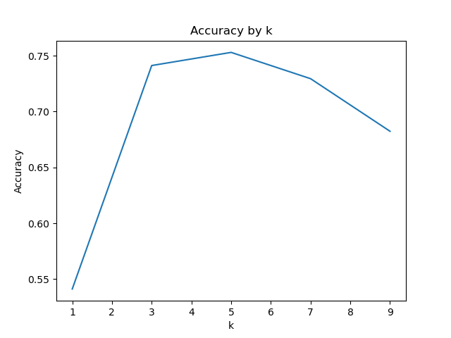
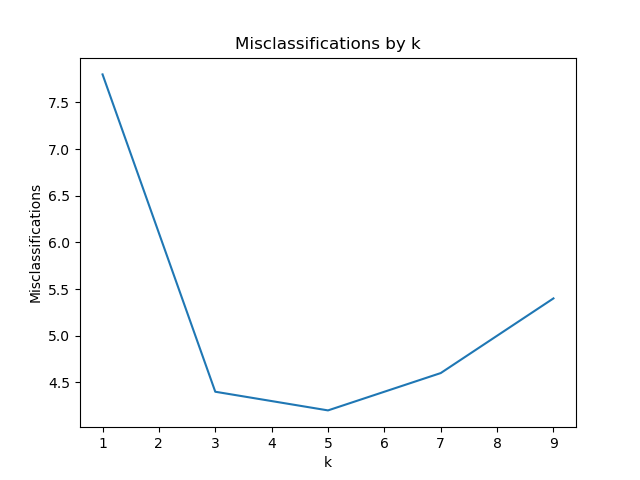
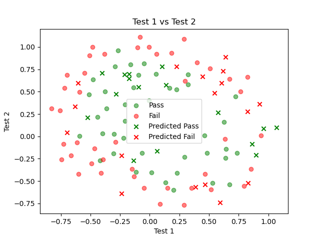

# project 2 writeup

## problem description

this project is about creating a QC testing algortim using knn classification and kfold cross validation to determin optimal k value and apply this to the testing dataset for capacitors.

## procedure decription

- import training data
- use old knn function
- define folds and knns
- for each knn
  - for each fold
    - split data and train
    - test and record accuracy
  - record average accuracy
- find best knn
- import testing data
- use best knn to predict
- export predictions

## graphs

## final results

|          | Predicted 0 | Predicted 1 |
| -------- | ----------- | ----------- |
| Actual 0 | 10          | 6           |
| Actual 1 | 7           | 10          |

accuracy: 0.6061, precision: 0.6250, recall: 0.5882, f1: 0.6061
