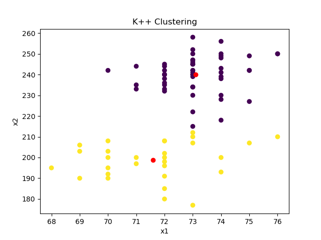

# Report

Ayush Paul

## Table

| .   | initial centroids                        | final centroids                                                                    | j value            |
| --- | ---------------------------------------- | ---------------------------------------------------------------------------------- | ------------------ |
| 0   | [array([ 73, 234]), array([ 73., 245.])] | [(72.12244897959184, 212.10204081632654), (73.21212121212122, 245.36363636363637)] | 917.5279563216483  |
| 1   | [array([ 70, 208]), array([ 73., 246.])] | [(71.75, 200.5625), (73.08, 241.44)]                                               | 559.2694156293794  |
| 2   | [array([ 69, 206]), array([ 73., 240.])] | [(71.75, 200.5625), (73.08, 241.44)]                                               | 559.2694156293794  |
| 3   | [array([ 74, 239]), array([ 72., 191.])] | [(73.09433962264151, 240.1320754716981), (71.58620689655173, 198.72413793103448)]  | 575.8269931613411  |
| 4   | [array([ 72, 208]), array([ 72., 180.])] | [(72.67567567567568, 229.6216216216216), (71.5, 187.25)]                           | 1239.7713400564198 |

# best graph

